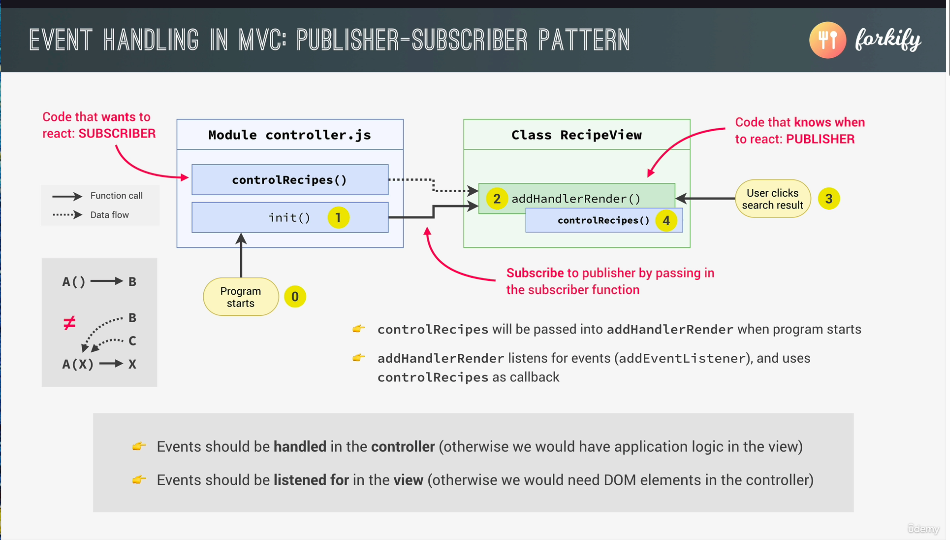

## Event Handles In MVC



So we have to manually start whatever we want to run first.

```js
// Publisher - Subscriber pattern
const init = function () {
  recipeView.addHandleRender(controlRecipes);
};
init();
```

```js
// Recipe.js
// New Method Class RecipeView

  addHandleRender(handler) {
    ["hashchange", "load"].forEach((event) =>
      window.addEventListener(event, handler)
    );
  }
```
